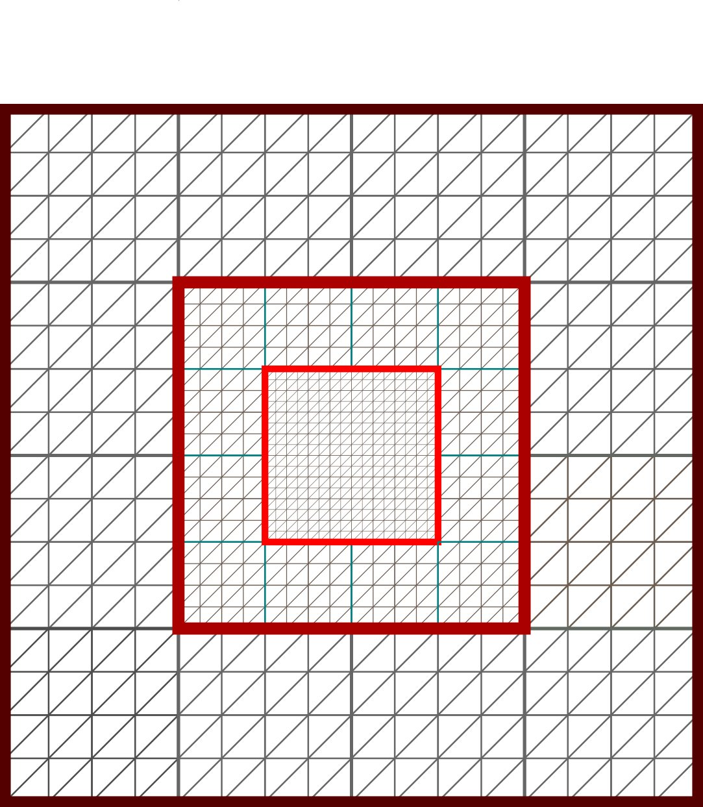
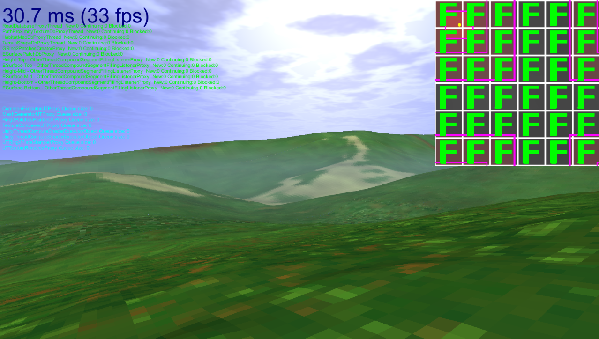

# Wyświetlanie terenu

System generowania i wyświetlania terenu tworzyłem z myślą o wykorzystaniu go w mechanizmie  wizualizacji istniejącego obszaru górskiego na podstawie danych kartograficznych. W tym celu powinien spełniać on zestaw wymagań, niezbędnych aby wyświetlać dynamicznie zmieniający się, rozległy obszar.

Wymogi:
+ Obecność mechanizmu zmieniającego poziom szczegółowości modelu i zasobów wykorzystywanych w poszczególnych miejscach terenu – obszar leżący w znacznym oddaleniu od kamery powinien wymagać mniej trójkątów przy wyświetlaniu.
+ Zmiana poziomu szczegółowości powinna być możliwie płynna i niezauważalna
+ Obecność mechanizmu doczytywania wymaganych zasobów w kawałkach podczas rozgrywki.
+ Mechanizm pozwalający na ograniczanie różnic pomiędzy doczytywanymi kawałkami zasobu – dla poszczególnych segmentów mapy terenu mogą wystąpić nieciągłości na wspólnej granicy, które należy wygładzić.

Teren postanowiłem wyświetlać, wykorzystując statyczne, płaskie meshe. Są one przesuwane w czasie działania programu. Dwuwymiarowe położenie poszczególnych wierzchołków w meshu nie podlega modyfikacji. Wysokość wierzchołków jest osobno obliczana w shaderze wierzchołkowym dla każdej klatki.

Wierzchołki rozłożone są w regularnych odstępach. Sama ilość wierzchołków na ilustracji określona  została, aby dogodnie przedstawić działanie algorytmu. W programie można ją konfigurować i jest znacznie większa. 
Siatkę podzielić możemy, według gęstości wierzchołków, na trzy sektory. Środkowy sektor posiada najgęściej występujące wierzchołki, sektor go otaczający cechuje się  gęstością czterokrotnie mniejszą – na obszarze jednego trójkąta sektora otaczającego zmieścić się mogą cztery   trójkąty z elementu wewnętrznego. 

Sektory te nazywam „*pierścieniami*” (**Ring**). Należy zauważyć, że najmniejszy pierścień jest prostokątem, a w szczególnym, ilustrowanym przypadku  kwadratem. 
Zasadniczo ilość pierścieni może być dowolnie duża, w programie wykorzystuje jednak trzy pierścienie. 	
W czasie działania programu staram się, aby kamera ustawiona była możliwie blisko środka pierścieni. Zgodnie z założeniami oddalone obszary rysowane będą z mniejszą szczegółowością.

W wierzchołkowym programie cieniującym wysokość poszczególnych wierzchołków określana jest na podstawie heightmapy, nazywaną „*teksturą  podłogi*” (**floorTexture**). Dziele ją na kwadratowe sektory. Wysokości z danego sektora mogą być osobno obliczane, a następnie wklejane do tekstury podłogi.
Zestaw pierścieni, wraz z teksturą podłogi nazywam „*piramidą*” (**pyramid**).

Rozdzielczość tekstury podłogi zależna jest od rozmiaru pierścieni oraz gęstości wierzchołków. Obszar pokrywany teksturą  powinien być większy niż ten reprezentowany przez pierścienie. Niektóre sektory powinny dla danego ustawienia piramidy nieużywane – na ilustracji są one niepokryte żółtą barwą. Kiedy piramida poruszać się będzie względem tekstury, nieużywane sektory zostaną czyszczone i wypełniane nowymi danymi w tle. Liczę, że dzięki temu rozwiązaniu tworzenie heightmapy dalej leżącego obszaru będzie niewidoczne dla gracza.

Dla danego ustawienia piramidy względem tekstury każdemu wierzchołkowi przypisać można dokładnie jeden, unikalny piksel. Co więcej, ustawienie jest tak określane, aby każdy wierzchołek umieszczony został „w środku” piksela.
Rozdzielczość tekstury podłogi jest tak określona, że sąsiednie wierzchołki pierścienia 0 korzystają z danych wysokościowych pobranych z sąsiednich pikseli. Zauważmy jednak, że zależność ta nie może występować dla dalszych pierścieni – te cechują się mniejszą gęstością wierzchołków, przez co pojedynczemu wierzchołkami odpowiada kilka pikseli. 
Zdecydowałem się na wykorzystanie tutaj systemu dynamicznie generowanych mipmap tekstury podłogi. Gęstość rozłożenia wierzchołków dla sąsiednich pierścieni różni się czterokrotnie, więc wykorzystanie kolejnych poziomów mipmapy skutkować będzie przypisaniem wierzchołkom dokładnie jednego piksela.

Tekstura podłogi jest odczytywana z zawijaniem „współrzędnych UV” (*uv wrapping*).  Możemy przyjąć, że dla shadera wierzchołków pierścieni tekstura ta jest nieskończenie rozległa i nieruchoma względem układu współrzędnych. To piramida będzie się poruszać i odczytywać kolejne dane z tekstury.

## Poruszanie piramidą

Gracz w czasie rozgrywki będzie oczywiście w stanie poruszać się na poziomej płaszczyźnie sceny. Aby zachować poziomy szczegółowości terenu, niezbędne jest, aby i piramida poruszała się wraz z nim. Chciałem przy tym zachować jednak ograniczenie wymagające, aby każdy wierzchołek leżał dokładnie nad jednym pikselem tekstury podłogi. 
Decyzje tą podjąłem, kierując się chęcią ograniczenia widocznych zmian kształtu terenu w czasie ruchu. Możliwe było oczywiści przyjęcie innych założeń i poruszanie piramidą tak, aby gracz zawsze znajdował się w jej środku. Przeanalizujmy jednak, co działoby się wysokością wierzchołków w czasie takiego ruchu. Współrzędne UV  obliczane w wierzchołkowym shaderze, a używane do odczytania danych z tekstury podłogi, nie będą trafiać w środki pikseli.

 Jeżeli wartości pikseli pobierane są z wykorzystaniem filtrowania, to obliczona wartość zostanie określona poprzez interpolacje wysokości najbliższych pikseli. W czasie ruchu gracza wszystkie wierzchołki zdawać się będą ruszać w osi pionowej, co może wyglądać nieatrakcyjnie.  

W przypadku, kiery filtracja nie zostanie wykorzystana, dane pobrane zostaną z piksela najbliższego. Wierzchołki zmieniać wysokość będą skokowo, co jest łatwo zauważalne.

Różowy punkt reprezentuje gracza.

Piramidą poruszam osobno w obu poziomych osiach, przesuwając obiekt o skwantyzowane odległość. Odległość ta równa jest dystansowi między dwoma wierzchołkami największego pierścienia. Położenie wierzchołków w centrum pikseli zostanie zachowane, jednak należy zauważyć, że o ile dla najdalszego pierścienia wystąpi przeskok o jeden piksel, to dla pierścieni o bardziej gęstej siatce trójkątów „skok”  okaże się znaczniejszy.

Zieloną barwą zaznaczono nowy obszar reprezentowany przez piramidę, a barwą niebieską teren, który zniknął.

## Interpolacja wysokości

Opisany mechanizm ruchu generuje jednak pewne negatywne w odbiorze efekty – podczas skoku poziom szczegółowości dla terenu, który zmienił przypisanie do pierścienia, gwałtownie się zmienia. Jest to sprzeczne z wymaganiami. 
Problem ten postanowiłem rozwiązać, implementując interpolacje wysokości w ograniczonym obszarze. Wierzchołki będą płynnie zmieniać wysokość podczas ruchu kamery, zmiany te ograniczę jednak do niedużej części terenu, co powinno zmniejszyć negatywne odczucia.
Zauważmy, że dla dwóch pierścieni, ten wewnętrzny może doskonale reprezentować teren ze szczegółowością odpowiadającą pierścieniowi zewnętrznemu. Dla każdych czterech wierzchołków pierścienia wewnętrznego jeden pobiera wysokość z mipmapy tekstury podłogi poziomu pierścienia zewnętrznego, a pozostałe określają swoją wysokość, pobierając wartości wykorzystując filtracje. 
Mechanizm ten nie działa oczywiście na odwrót – pierścień zewnętrzny posiada zbyt rzadko rozłożone wierzchołki.

Piramida z zaznaczonymi obszarami interpolacji.

Dla każdego pierścienia wprowadziłem obszary, gdzie następuje płynna zmiana do niższego poziomu szczegółowości. Obszary te, nazywane „obszarami interpolacji”, mają kształt cienkich pierścieni. Każdy pierścień piramidy posiada jeden obszar. Interpolacja wysokości dla pary poziomów szczegółowości wykonywana jest w programie cieniującym i wymaga pobrania dwóch wartości z tekstury podłogi.

Umiejscowienie obszaru interpolacji zależy od położenia gracza na płaszczyźnie poziomej. Należy tak określić odległość obszarów od granicy pierścienia, aby dla maksymalnie oddalonego od środka piramidy gracza obszar interpolacji nie został umieszczony poza pierścieniem.
Zauważmy tutaj pewien negatywny efekt wykorzystanego rozwiązania – dla części siatki trójkątów leżących na zewnątrz obszarów interpolacji „marnujemy” wierzchołki. W miejscach tych teren zostaje wyświetlony ze szczegółowością, dla której wystarczyłoby czterokrotnie mniej wierzchołków.

## Zestaw piramid
Wyświetlanie bardzo rozległego terenu z zachowaniem poziomów szczegółowości siatki wymaga wykorzystania większej ilości pierścieni. Należy jednak zauważyć, że dodatkowe pierścienie będą posiadały coraz bardziej oddalone wierzchołki, a to determinuje długość skoku podczas ruchu.
Im większy jest skok, tym bliżej środka pierścienia znaleźć się muszą obszary interpolacji. To oczywiście pogłębia problem marnowania wierzchołków. Co więcej, duża piramida wymaga dużej mapy podłogi, a w mojej implementacji poszczególne sektory należy obliczać z maksymalną szczegółowością, nawet jeżeli te odczytywane będą jedynie przez najdalej leżące pierścienie. Oczywiście, możliwa byłaby taka implementacja, gdzie umieszczane przez skrypt będą też sektory mipmap, lecz pozostaje wtedy i tak problem zużycia pamięci dla dużej mapy podłogi.

 Postanowiłem rozwiązać problem wyświetlania większego terenu w alternatywny sposób. Wykorzystuje kilka piramid ze środkami jak najbliżej położenia gracza. Piramidy mają przypisane osobne mapy podłogi. Pierścień 0 zewnętrznych piramid cechuje się kształtem prostokąta z wycięciem w środku. W programie wykorzystuje trzy piramidy. 

Poszczególne piramidy poruszają się niezależnie, ponieważ ich ruch cechuje się niejednakowym skokiem. Wycięcie w środku pierścienia 0 powinno zmieniać swoje umiejscowienie. Algorytm zapewniający taką funkcjonalność zaimplementowany jest w shaderze. Należy zauważyć, że shader rysujący piramidę zewnętrzną musi mieć informacje o rozmiarze i położeniu piramidy wewnętrznej.
Pomiędzy pierścieniem 0 piramidy zewnętrznej a pierścieniem 2 piramidy wewnętrznej występuje różnica poziomu szczegółowości. Podobnie jak w przypadku pierścieni pojedynczej piramidy różnicę tą ukrywam za pomocą obszaru interpolacji. Zauważmy, iż do implementacji takiej funkcjonalności program cieniujący musi mieć dostęp do dwóch tekstur podłogi. Na szczęście, jeżeli elementy te wszystkich piramid cechują się taką samą rozdzielczością, co mogą zostać umieszczone w tablicy tekstur (Texture2DArray). Algorytm dwukrotnie próbkować będzie obiekt tego rodzaju.

Program zachowuje stosunek poziomów szczegółowości pomiędzy sąsiednimi pierścieniami, nawet jeżeli należą do różnych piramid.

| Piramida		| Pierścień		| Odległość między próbkami|
|:------------: |:-------------:|:-----:|
|0				|0				|0.375m|
|0				|1				|0.75m |
|0				|2				|1.5m|
|1				|0				|3m|
|1				|1				|6m|
|1				|2				|12m|
|2				|0				|24m|
|2				|1				|48m|
|2				|2				|96m|

W przypadku mojego programu, za pomocą zestawu piramid określam nie tylko wysokość wierzchołków, ale także barwę powierzchni oraz wektory normalne powierzchni. Zauważmy też, że dla cech innych niż wysokość zależności między teksturą podłogi a siatką trójkątów nie muszą być koniecznie zachowane. Piramid określających kolor może być przykładowo więcej niż trzy dla analizowanej siatki – barwa nie będzie bowiem określana dla wierzchołków a dla pikseli, w pikselowym shaderze. 

## Działanie programu testowego

Oczekiwany obraz po zakończeniu wczytywania. Umieszczenie kamery odpowiada położeniu na polanie [Norczak](https://www.openstreetmap.org/#map=16/49.6048/19.5500) i zwróceniu na południe.

Rozwiązanie najlepiej uruchomić w edytorze, w scenie [ETerrainAsync](https://github.com/defacto2k15/PwMgr/tree/master/Assets/Projects/Extended/ETerrainAsync.unity) . Kompilacja i uruchomienie programu jako pliku wykonywalnego też powinno zadziałać. Nalezy podkreślić, że program tworzyć będzie pliki w folderze [precomputedResources/unityCache](https://github.com/defacto2k15/PwMgr/tree/master/precomputedResources/unityCache) dla tekstury ziemi, oraz [precomputedResources/surfaceCache](https://github.com/defacto2k15/PwMgr/tree/master/precomputedResources/surfaceCache) dla powierzchni terenu. Początkowe tekstury segmentów już się tam znajdują, nowe zostaną dodane wraz z poruszaniem się kamery.

Przygotowany program  demonstracyjny pozwala na poruszanie się kamerą w przygotowanej przestrzeni trójwymiarowej zawierającej generowany term. Ruchu możliwy jest za pomocą:

+ Klawiszy **WASD** - ruch poziomy
+ Klawiszy **EQ** - zmiana wysokości
+ Mysz - obrót kamery
+ **Shift** - Przyspieszenie ruchu

 W górnym prawym rogu ekranu znajduje się mapa przedstawiająca teksturę podłogi wybranej piramidy z podziałem na sektory i pierścienie.

Wyświetlaną piramidę przełączać można klawiszami **<** oraz **>**. Mapa przedstawia też informacje o stanie przetwarzania danego sektora. 

W przypadku, kiedy do wyświetlania terenu wymagana jest obecność nieprzygotowanego jeszcze sektora, ruch kamery zostaje zablokowany.