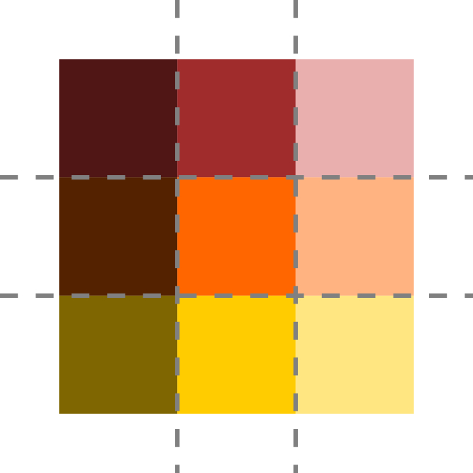

# Generacja mapy wysokości

Generacją mapy wysokości nazywam proces, w którym na podstawie wejściowej mapy wysokościowej oraz zaimplementowanych algorytmów tworzona jest tekstura o określonej szczegółowości zawierająca informacje o wysokości danego segmentu terenu.

## Dane wejściowe

Podstawowym zasobem wejściowym jest mapa wysokościowa o rozdzielczości jednej sekundy kątowej pochodząca z projektu **SRTM** (*Shuttle Radar Topohraphy Mission*). Pobrane dane mają charakter dwuwymiarowej tekstury o rozdzielczości 3601 na 3601 pikseli i zadeklarowanymi odległościami pomiędzy kolejnymi próbkami wynoszącymi średnio 30 metrów. Poszczególne próbki zawierają informacje o wysokości zapisane jako dwubajtowa liczba całkowita oznaczająca ilość metrów n.p.m.

Należy zwrócić uwagę na pewne szczegóły wynikające z niedokładności przedstawiania trójwymiarowej powierzchni ziemi za pomocą dwuwymiarowej mapy wysokości. Wejściowa mapa opisuje obszar od 49N, 19E  do 50N, 20E. Odległości między wierzchołkami na równoleżniku 49N wynosi 72.95km  a na równoleżniku 50N 71.47km. Dystans między wierzchołkami na południkach to 111.2 km. Poszczególne próbki są więc znacznie bliżej niż co 30m. Aby skoncentrować się na problemie wyświetlania terenu, a ignorując dokładne odwzorowanie graficzne, postanowiłem pominąć takie nieścisłości przyjmując, że wejściowa mapa przedstawia wysokość obszaru kwadratowego o odległości między próbkami wynoszącego 24m. Znacznie ułatwiło mi to dalsze działania, kosztem ograniczenia jakości odwzorowania. Pomijam też podczas wyświetlania krzywiznę ziemi.

## Zwiększanie poziomu szczegółowości

 Próbki co 24 metrów wystarczają do reprezentowania terenu znacznie oddalonego, ale są niewystarczające dla bliższych obszarów. Postanowiłem więc zaimplementować zestaw algorytmów, które wykorzystując techniki proceduralne, w tym szum i symulacje fizycznych fenomenów, dodają pewną szczegółowość do mapy wysokości.
 
Zasadniczo skrypty programu nie korzystają bezpośrednio z mapy wejściowej, a z mniejszych segmentów. Każdy segment to tekstura o rozdzielczości 240 na 240 pikseli. Mapa wejściowa podzielona zostaje na 15x15 segmentów. Wspieram trzy poziomy szczegółowości – dla 24m na próbkę (niski), 3m na próbkę (średni) oraz 0.375m na próbkę (wysoki). Długość terenu reprezentowanego przez segment w przestrzeni świata to dla różnych poziomów szczegółowości kolejno 5760m, 720m oraz 90m. 

### Metody dodające szczegółowość:
#### Szum fraktalny 
( [https://github.com/defacto2k15/PwMgr/tree/master\Assets\Heightmaps\Ring1\TerrainDescription\FeatureGenerating\RandomNoiseTerrainFeatureApplier.cs](RandomNoiseTerrainFeatureApplier) )

#### Algorytm diament-kwadrat
([https://github.com/defacto2k15/PwMgr/tree/master\Assets\Heightmaps\Ring1\TerrainDescription\FeatureGenerating\DiamondSquareTerrainFeatureApplier.cs](DiamondSquareTerrainFeatureApplier))

#### Erozja termalna
([https://github.com/defacto2k15/PwMgr/tree/master\Assets\Heightmaps\Ring1\TerrainDescription\FeatureGenerating\ThermalErosionTerrainFeatureApplier.cs](ThermalErosionTerrainFeatureApplier) oraz wersja alternatywna [https://github.com/defacto2k15/PwMgr/tree/master\Assets\Heightmaps\Ring1\TerrainDescription\FeatureGenerating\TweakedThermalErosionTerrainFeatureApplier.cs](TweakedThermalErosionTerrainFeatureApplier))

#### Erozja hydrauliczna
([https://github.com/defacto2k15/PwMgr/tree/master\Assets\Heightmaps\Ring1\TerrainDescription\FeatureGenerating\HydraulicErosionTerrainFeatureApplier.cs](HydraulicErosionTerrainFeatureApplier))

Dodatkowo kształt terenu wzbogacam o umieszczanie na nich wygładzeń reprezentujących rzeczywiście istniejące ścieżki ([https://github.com/defacto2k15/PwMgr/tree/master\Assets\Heightmaps\Ring1\TerrainDescription\FeatureGenerating\RoadEngravingTerrainFeatureApplier.cs](RoadEngravingTerrainFeatureApplier)).

Jako parametr wejściowy algorytm otrzymuje niezmodyfikowaną lub wstępnie zmodyfikowaną teksturę segmentu.
Z wyjątkiem algorytmu diament-kwadrat, algorytmy wykonywane są na GPU, z wykorzystaniem odpowiednich shaderów.  

## Poziomy szczegółowości

Wspierane poziomy szczegółowości wymagają odpowiednio przemyślnego systemu uwzględniającego szczegółowość niższych poziomów podczas generacji segmentów o szczegółowości wyższej. W przypadku, kiedy skrypt wymaga dostępu do segmentu o wysokiej szczegółowości, najpierw wygenerowany zostać musi segment o niższym poziomie detali. Po ukończeniu procesu tworzenia tego zasobu wycięty z niego zostaje mały obszar będący teksturą daną wejściową wzbogaconą o detale przez algorytmy wyższej szczegółowości. Dzięki temu segment o wysokiej szczegółowości zawiera też detale obecne w segmentach o średnim i niskim poziomie detali.

## Scalanie segmentów
Podkreślić należy, iż poszczególne segmenty wzbogacone o detale zostają osobno. Efektem takich działań może być sytuacja, gdzie wysokość segmentów na granicy ich łączącej nie jest identyczna. Utworzyłem system, który scala mapy stykających się segmentów. 

Zestaw dziewięciu sąsiadujących segmentów.

Postanowiłem scalać okolice brzegów segmentów na podstawie informacji o segmentach stykających się w danym rogu. Brzegi dziele więc na cztery grupy, przypisane do danego rogu segmentu – dla każdego brzegu jego połowy należą do różnych grup i będą osobno scalane.

Podział brzegów na grupy.

Zasadniczo do grupy przypisać można cztery połówki brzegu z czterech segmentów, ale scalanie wykonywane będzie osobno dla każdego z segmentów.
Każdą połówkę brzegu współdzieli para segmentów. Postanowiłem taką parę segmentów połączyć relacją nadrzędny- podrzędny. Kształt brzegu definiowany jest wyłącznie przez segment nadrzędny – do elementu podrzędnego kształt powierzchni w pobliżu granicy będzie modyfikowany tak, aby płynnie dopasować go do brzegu. 

Połówki brzegów należące do jednej grupy.

Relacje między segmentami przy scalaniu brzegów wokół wspólnego wierzchołka przedstawiłem na diagramie. Należy zauważyć, że kolejność scalania dla segmentów 2 i 3 nie jest istotna – nie współdzielą one brzegu, a wysokość wspólnego wierzchołka definiuje segment 1.  Warto też podkreślić, że na kształt brzegu B wpływ będzie miał segment 1, pomimo że go nie współdzieli. 

Barwy przedstawiają wpływ segmentów na wysokości brzegowe.

Wpływ segmentów nadrzędnych.

Wysokość segmentu jako składowe sumy.

Należy podkreślić, że duży rozmiar obszaru modyfikacji, obecny na poprzednich diagramach, występuje w celach ilustracyjnych. W programie jest on konfigurowalny i mniejszy.

W celu scalenia wszystkich brzegów segmentu niezbędna jest obecność dodatkowych trzech sąsiednich segmentów. Na szczęście te dodatkowe segmenty nie muszą być scalone, więc unikamy problemu nieskończonej rekurencji przy scalaniu. Oczywiście wystąpią dodatkowe koszty obliczeniowe, wynikające z potrzeby generowania większej ilości segmentów niż te używane do wyświetlania terenu. 

## Przechowywanie segmentów

Tworząc rozwiązanie ,spotkałem się z problemem określenia efektywnej metody przechowywania i zarządzania segmentami. Zauważyłem, że niezbędne jest niekiedy kilkukrotne wykorzystywanie pewnych segmentów, pomimo nieużywania ich do wyświetlania terenu. Powtarzające się tworzenie i usuwanie tego rodzaju zasobów byłoby znacznym marnotrawstwem. Wprowadziłem obiekt określany jako pamięć podręczna (*cache*), zawierający referencje do wszystkich utworzonych segmentów oraz informacji je charakteryzujących. Ilość obiektów wykorzystujących zasób w danej chwili określana jest poprzez wykorzystanie mechanizmu zliczania referencji (*reference counting*).  Kiedy licznik taki osiągnie wartość zerową, element nie jest od razu kasowany. Przechowuje pewną ilość „nieużywanych” segmentów, ograniczoną przyporządkowaną ilością pamięci. Stosunkowo często elementy takie znów są potrzebne, a przechowywanie ich czyni powtórną generację zbędną.
Drugim problemem jest znaczna ilość czasu wymagana, aby wygenerować zestaw segmentów wykorzystywany podczas uruchomienia programu. Zaimplementowałem mechanizm zapisywania utworzonych segmentów na dysku. Powtórnie uruchomiony program nie potrzebuje więc znów generować segmentów.  W przypadku, kiedy dany segment jest niezbędny do działania programu i nie znajduje się w pamięci podręcznej, przed generacją sprawdzane jest, czy został on wcześniej zapisany na dysku. 
Rozwiązanie to stosuje nie tylko dla segmentów mapy wysokości, ale także przy obsłudze tekstury powierzchni oraz map normalnych.  

