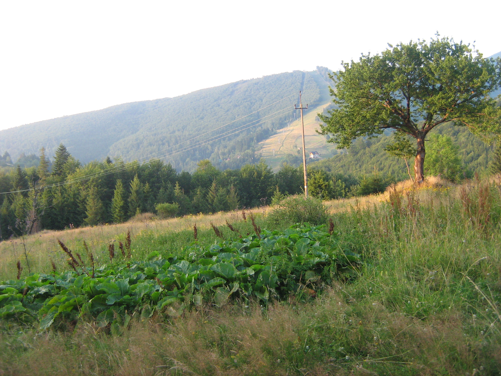

# Wstęp

Celem projektu jest utworzenie systemu generującego wizualizacje dużej trójwymiarowej sceny przedstawiającej zalesiony teren górski przypominającej istniejący obszar. Możliwa powinna być generacja kolejnych klatek z szybkością pozwalającą na płynną animację. Użytkownik kontroluje kamerą poruszającą się po utworzonym terenie. Sam obszar pokryty powinien zostać roślinnością umiejscowioną w sposób naśladujące rzeczywiste zalesienie na tych obrazach. Tekstura bryły terenu odpowiadać ma reprezentowanemu miejscu.

Danymi źródłowymi są mapy wysokościowe z projektu *SRTM* oraz dane kartograficzne pochodzące z usługi *OpenStreetMap*.

Odtwarzany teren naśladować powinien swoim wyglądem Babiogórski Park Narodowy, znajdujący się przy południowej granicy Polski.

Postanowiłem nie korzystać z obecnego w Unity systemu terenu i samemu opracować rozwiązanie o porównywalnej funkcjonalności.

Zachowanie wysokiej ilości generowanych klatek na sekundę podczas wyświetlania ogromnej sceny z dużą ilością roślin wymagać będzie implementacji nietrywialnych rozwiązań zmieniających poziom szczegółowości.

